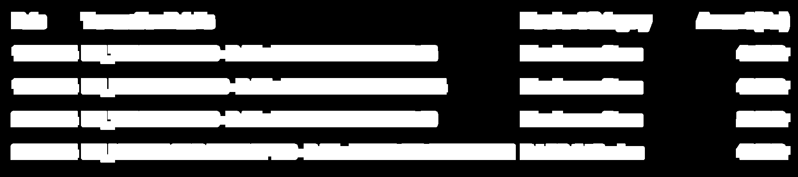

# **Tablify** - Convert Images to Tabular Data using OCR

**Tablify** is a Python-based tool that converts tabular data from images into CSV files using Optical Character Recognition (OCR). It processes images, extracts the text using `pytesseract`, and organizes it into rows and columns for easy data extraction and analysis.

## **Features:**
- Converts images of tables into structured CSV files.
- Uses `pytesseract` to perform OCR on images.
- Processes images to detect individual text blocks, sort them by coordinates, and group them into rows.

## **Installation:**

1. **Clone the repository:**

   ```bash
   git clone https://github.com/yourusername/Tablify.git
   cd Tablify
   ```

2. **Install required dependencies:**

   Make sure you have Python 3.x installed. Then, install the required libraries:

   ```bash
   pip install -r requirements.txt
   ```

3. **Install Tesseract OCR:**

   - **Windows:** Download the Tesseract installer from [here](https://github.com/UB-Mannheim/tesseract/wiki) and add the path to your system environment variables.
   - **Linux:** Install Tesseract using:

     ```bash
     sudo apt install tesseract-ocr
     ```

   - **macOS:** Use Homebrew to install Tesseract:

     ```bash
     brew install tesseract
     ```

## **How to Use:**

1. **Prepare an Image:**
   Ensure the image contains tabular data that you want to extract. The tool works best with clear, well-contrasted images.

2. **Run the Script:**
   After setting up, simply run the script on your image:

   ```bash
   python tablify.py path/to/your/image.jpg
   ```

   This will generate a `output.csv` file in the same directory.

3. **Check the Output:**
   Open `output.csv` to see the extracted table data in tabular format.

## **Process Inside Tablify:**
1. **Image Preprocessing:**
   The image is converted to grayscale, and a binary thresholding is applied to make the text clearer for OCR.

   Original:
   

   Grayscale:
   

   After OTSU thresholding:
   

   Dilation:
   
   
2. **Contour Detection:**
   Using OpenCV, contours of the text blocks are identified to group text into rows and columns.

   Marked Countours:
   

   Marked Centroids of the countours:
   
   
3. **Text Extraction:**
   Each text block is processed with `pytesseract` to extract the text, which is then organized into a structured CSV format.

4. **CSV Generation:**
   The processed text is organized into rows based on vertical alignment and saved as a CSV file.


## **License:**

This project is licensed under the MIT License
